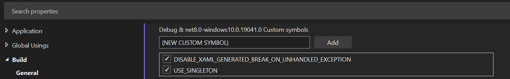

##### windows-com-exception-minimal-reproducible-example

This code attempts to remove all the other variables to focus on what I like to call the "smoking line".

___

_This borrows a term from a criminal investigation, and is a reference to the "smoking gun" that proves "who did the crime"._
___

In this case, the line is `builder.Services.AddSingleton<ChildPageA>()`. If the singleton is disabled by un-checking `USE_SINGLETON` then, the COM error goes away.



___

One thing we want to avoid is causing _new_ exceptions in the process of looking for the first one. One example would be trying to shut down the app while the continuous loop is running.

```
// If the loop is running, and we try to close the app, it's
// possible to cause an exception by trying to navigate when
// the main window handle has already disposed, so we check.

if (App.Current?.MainPage?.Handler != null)
{
	// Should be safe to call GoToAsync()
}
```
___

#### Working around the platform issue

By handling the `COMException` and retrying the navigation, we can make the application resilient to the platform error. Here's the final block with a 5x retry.

```
protected override async void OnNavigatedTo(NavigatedToEventArgs args)
{
    base.OnNavigatedTo(args);

    // If the loop is running, and we try to close the app, it's
    // possible to cause an exception by trying to navigate when
    // the main window handle has already disposed, so we check.
    if (App.Current?.MainPage?.Handler != null)
    {
        await Task.Delay(App.PING_PONG_INTERVAL);
        int tries = 1;
        retry:
        try
        {
            await Shell.Current.GoToAsync($"///{nameof(MainPage)}");
        }
        catch (System.Runtime.InteropServices.COMException ex)
        {
            if (tries == 1) App.ReportError(ex, sender: nameof(ChildPageA));
            if (tries++ < 5)
            {
                goto retry;
            }
            else throw new AggregateException(ex);
        }
    }
}
```
